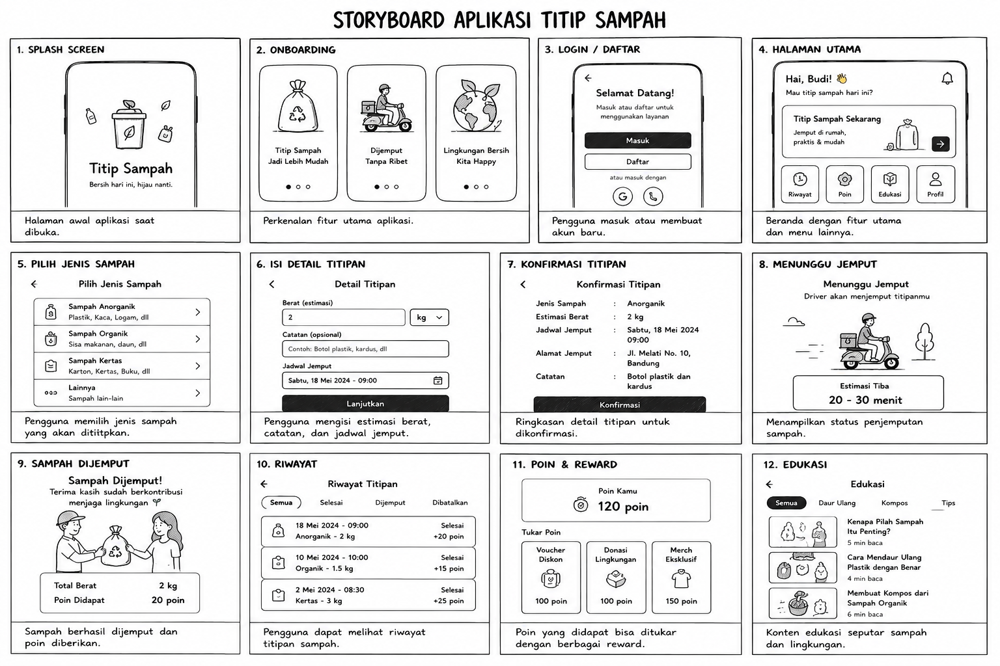
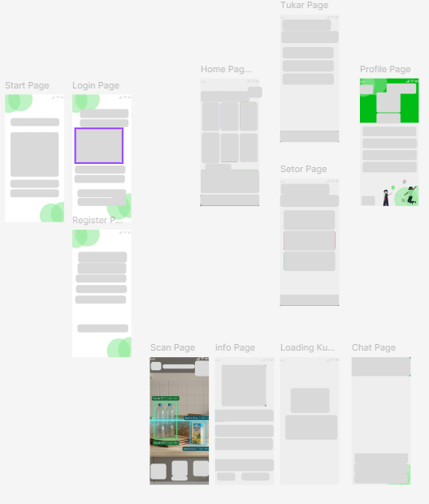
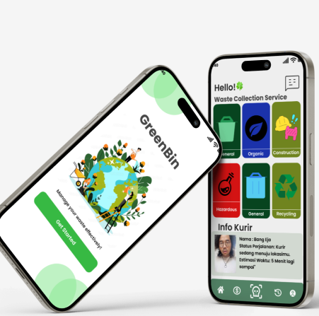
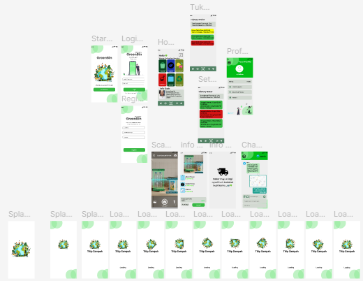
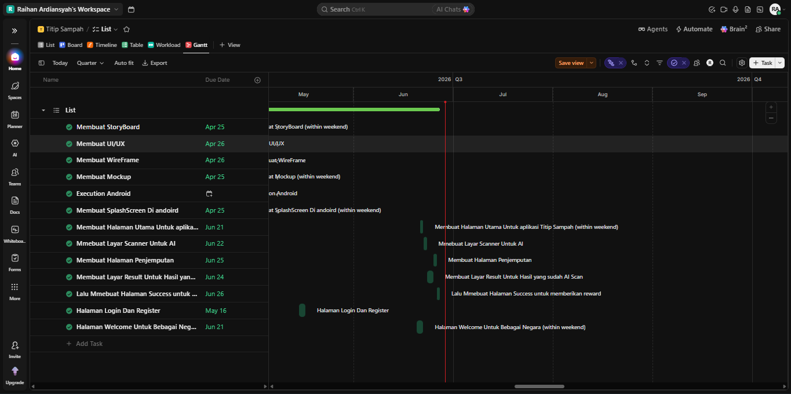

# UAS_PEMOGRAMAN_MOBILE-1

# Nama:Raihan Ardiansyah

# Nim: 312410396

# Kelas: TI.24.A.3

# Mata Kuliah: Pemograman Mobile 1

# Projeck Android: Aplikasi ToDoList

**Berikut alur dari pembuatan aplikasinya**

1. Membuat story board

2. WireFrame

3. Mockup

4. UI dan UX

5. ClickUp

ini Link ClickUpnya: https://app.clickup.com/90181811659/v/s/901810066212

**Dan ini hasil akhir dari aplikasi yang saya buat**

**Link Youtube**

* Aplikasi Berjalan: https://youtube.com/shorts/n0bgM10qOUw?si=cnddOi3fcHcUpz4L 

# TiitipSampah (GreenBin App) ☘️♻️

**TiitipSampah** adalah aplikasi berbasis Android yang dirancang untuk mempermudah manajemen dan penjemputan sampah secara cerdas, cepat, dan terintegrasi. Proyek ini dikembangkan menggunakan **Java** dan **Android Studio** sebagai bagian dari tugas akademik di Universitas Pelita Bangsa.

---

## 🚀 Fitur Utama

*   **AI Scan & Point System:** Mendeteksi jenis sampah secara otomatis (Botol plastik, organik, dll) dan mengonversinya menjadi poin XP/Reward secara realtime.
*   **Dynamic Courier System:** Memilih kurir penjemput secara acak dari database lokal lengkap dengan nama, plat nomor kendaraan, dan estimasi waktu perjalanan.
*   **Real-time Dashboard:** Menampilkan info kurir aktif yang sedang meluncur ke lokasi langsung di halaman utama.
*   **Session Persistence:** Aplikasi secara cerdas mengingat halaman terakhir yang dibuka. Jika aplikasi ditutup paksa (*force close*) saat mengedit profil, pengguna akan langsung dikembalikan ke halaman profil tanpa mengulang dari dasbor awal.
*   **Permanent Profile Storage:** Fitur ubah nama via dialog pop-up interaktif serta ganti foto profil dari galeri yang disimpan permanen menggunakan encoding *Base64 String* ke *SharedPreferences*.
*   **Transaction History:** Mencatat riwayat penyetoran sampah secara kronologis dengan data JSON terstruktur via library GSON.

---

## 🛠️ Teknologi & Library yang Digunakan

*   **Language:** Java
*   **IDE:** Android Studio (Edge-to-Edge display enabled)
*   **UI Layout:** ConstraintLayout, LinearLayout, Material Design 3 Components (ShapeableImageView, CardView, etc.)
*   **Data Storage:** SharedPreferences (Local Persistence)
*   **Data Parsing:** Google GSON (JSON compiler untuk data History)

---

## 📂 Struktur Kode Utama

*   `MainActivity.java`: Mengelola dasbor utama, sinkronisasi info kurir, dan muat foto profil secara real-time.
*   `OrderCourierActivity.java`: Logika kalkulasi poin sampah, pemilihan supir random, dan penyimpanan data ke preferensi.
*   `ProfileActivity.java`: Antarmuka edit nama menggunakan interaktif AlertDialog serta enkripsi foto profil galeri ke format Base64.
*   `SplashActivity.java`: Layar loading awal yang mengendalikan alur *session persistence* sebelum masuk ke aplikasi utama.

---

## 👤 Developer

*   **Nama:** Raihan Ardiansyah
*   **Jurusan:** Teknik Informatika (Informatics Engineering)
*   **Kampus:** Universitas Pelita Bangsa
